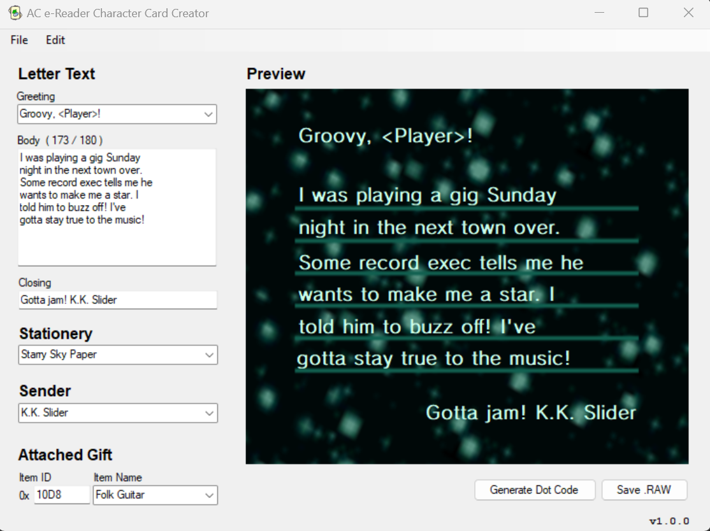
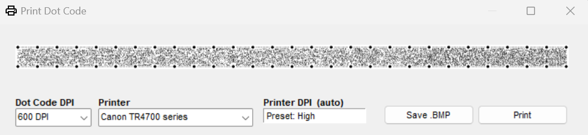

# e-Reader Card Creator

The e-Reader Card Creator is a frontend tool written primarily in C# designed to interact with Nintendo's e-Reader dot code data. This tool utilizes and builds off the work of [CaitSith2](https://caitsith2.com/), [Tim Schuerewegen](https://www.schuerewegen.tk/), and [BlackShark](https://github.com/Bl4ckSh4rk)'s e-Reader development contributions.

This tool currently only supports Windows operating systems.

IMPORTANT: Please keep the main executable in the same root directoy as `/Project Files/`

## Supported e-Cards & Formats
As of right now, this tool is designed specifically for a subset of North American Animal Crossing cards:
### Animal Crossing
- Character Cards
- Classic Game Cards

Other e-Cards, such as those from the Pokémon series or from Doubutsu no Mori e+ (*どうぶつの森ｅ＋*) are not yet supported.

## Features
- Read existing `.raw` e-Card data with a built-in preview
- Customize the e-Card's letter contents and attached gift when connected to the GameCube and scanned in-game
- Compress modified e-Cards back to `.raw`, or view the individual decompressed `.bin` and `.vpk` components
- Generate dot codes from e-Card data that can be saved as `.bmp` images or printed directly from the tool

## Getting Started
### Requirements
- Windows operating system

If you're interested in printing physical dot codes, you will also need to meet several printer requirements detailed here.

### Installation
Head to the [Releases page](https://github.com/Hunter-Raff/e-ReaderCardCreator/releases) to download the ZIP file and extract the latest version of this tool. Alternatively, you can download the source files here and build through Visual Studio 2019 or higher.

### Usage

This tool innately converts e-Card data from `.raw` to `.bin` and decompresses said data further to readable values. Each decompression step is logged as a file in `/Project Files/Decompression/eCard/`. Due to the program's reliance on external applications and reading/writing files, **it is important to keep the `/Project Files/` directory untouched unless you know what you're doing**. Ideally, the tool innately converts all external tools without processing shenanigans, but the source code did not cooperate with Windows Forms, even when re-written in modern C#... 

If the main executable is in the same root as `/Project Files/`, then using the program is as simple as launching the executable.
- Open existing e-Cards with `File > Open`
- Create a new e-Card with `File > New`
- Customize the e-Card with the appropriate input fields
- Save your customized e-Card as a `.raw` file for use in Dolphin Emulator
	- Alternatively, you can choose  `Generate Dot Code` and save the generated dot code as a `.bmp` image or print directly from the app.

## Printing Dot Codes
Generated dot codes can be physically printed for use on console via an official e-Reader. Due to the e-Reader's sensor and the small scale of the dot codes, this requires very specific setup.
### Requirements for Printing
- You must use a printer capable of printing at 600 DPI or higher, preferably 1200 DPI
- You must print dot codes on glossy or semi-glossy photo paper/cardstock; standard uncoated paper will NOT work
- You must position or cut the dot code so that the e-Reader can scan it, typically with 0.5cm-1cm paper margins
- You must hold the paper extremely steady and scan slowly; printing on smaller-sized glossy cardstock may help

### Setup
- Prepare your printer with glossy or semi-glossy photo paper/cardstock
- Adjust your printer settings to print at the highest resolution and sharpness possible. This should be at least 600 DPI, though 1200 DPI is highly recommended
- Adjust your printer settings to set your paper type as "Glossy" or "Photo Paper"

### Troubleshooting
Due to the many different types of printers and paper, printing your own dot codes is likely going to be a trial-and-error process to see what settings work for you.
- **e-Reader gives a "READ ERROR"**
	- Ensure the corresponding `.raw` file scans properly in Dolphin Emulator or a separate GBA emulator. If the card does not scan on emulator, something is wrong with the file contents itself and the dot code needs to be regenerated.
	- If the .raw file scans on emulator, then something is wrong with your physical dot code print.
		- Try different prints at 600 or 1200 DPI
		- Experiment with your printer settings. Set your printer to the highest resolution possible, preferably 1200 DPI. Adjust your paper type to "Glossy" or "Photo Paper"
		- If able, experiment with different paper types; not every "glossy" brand is reflective enough to get a proper scan.
		
- **e-Reader does not read the dot code at all**
	- Something is likely wrong with your dot code positioning on the paper. Ensure it is roughly 0.5cm-1cm above the edge of the paper.
	- Experiment with your paper margins and borders in your printer settings. There are oftentimes "borderless" or "margin" options that assist with positioning.

If nothing works, you can try to print from a `.raw` file directly through CaitSith2 or Tim Schuerewegen's standalone printing applications [found here](https://caitsith2.com/ereader/devtools.htm). Alternatively, you can try to position the `.bmp` image of the dot code in a photo editor and print from there.

## Screenshots

## Known Bugs
- Typing in the letter body textbox requires using newlines for the preview to update properly
- Some rendering issues with the preview letter (*see: Bunnie's official e-Card data*)
- Saving a dot code as a `.bmp` image currently does not prompt for the `.bmp` file extension. Saving still works, but manually adding the extension will save it with a double extension (`.bmp.bmp`)

## To-Do
- Add GBA letter customization support
- Convert external e-Reader dev tools to innate code without processing separately
- Add more error handling
- Look into DnM e+ support

## Contact
If bugs are found, I encourage bug reports via the [Issues page](https://github.com/Hunter-Raff/e-ReaderCardCreator/issues). You may also email issues to `hunterr.contact@gmail.com`.

## Acknowledgements
- [CaitSith2](https://caitsith2.com/) for use of their external e-Reader dev tools
- [Tim Schuerewegen](https://www.schuerewegen.tk/) for use of their external e-Reader dev tools
- [BlackShark](https://github.com/Bl4ckSh4rk) for use of their `headerfix` program
